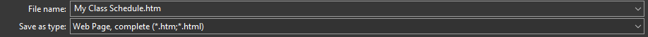
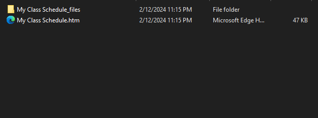

# uOCalendar
This API will take in the saved page of the "My Class Schedule" in list view and convert it to a ics file which can be imported to google calendar

## Instructions 
Go to the "My Class Schedule" through uozone and save the page. This can be done by right clicking on the page then selecting "Save As..." (Chrome) or "Save Page As" (Firefox). Enusre that "Save as type" is set as "Web Page, complete".

 
This will download two items as presented below
 

 
Navigate to the My Class Schedule_files and look for "SA_LEARNER_SERVICES.htm" and insert that file into the program. This htm file will be parsed and an ics file will be returned 
